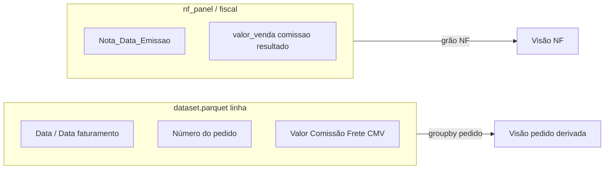

# Mapeamento: fontes para Resultado Gerencial ampliado

Este documento responde às três perguntas **sem propor implementação**. Evidências principais: [data_products/cliente_2/faturamento/current/metadata.json](data_products/cliente_2/faturamento/current/metadata.json), perfil executado sobre os Parquets (pandas), e contratos em [processing/faturamento/fiscal_devolucoes_materializado.py](processing/faturamento/fiscal_devolucoes_materializado.py), [processing/faturamento/nf_materializado.py](processing/faturamento/nf_materializado.py), [processing/faturamento/nf_panel_materializado.py](processing/faturamento/nf_panel_materializado.py).

---

## 1. Datas de venda vs `Nota_Data_Emissao`

### Onde aparecem datas

| Fonte (cliente_2) | Campos com “data” / emissão | Cobertura (amostra atual) | Interpretação |
|-------------------|------------------------------|---------------------------|---------------|
| [dataset.parquet](data_products/cliente_2/faturamento/current/dataset.parquet) (grão **linha/pedido-item**) | `Data` | 34 843 / 34 843 (100%) | Strings `DD/MM/YYYY` (ex.: `09/12/2025`, `12/01/2026`) — **candidato principal a “data da venda/pedido”** no export ML |
| Mesmo ficheiro | `Data do faturamento` | 34 843 / 34 843 (100%) | Distinta de `Data` na maior parte dos casos (~13,5% iguais); típica “data de faturamento/fecho” vs data do pedido |
| Mesmo ficheiro | `Nota_Data_Emissao` | 27 363 / 34 843 (~78%) | Emissão NF quando há nota ligada |
| Mesmo ficheiro | `Data_Processamento` | 100% | Timestamp único do batch (`2026-04-18T14:11:14Z`) — auditoria, não negócio |
| [dataset_faturamento_nf_panel.parquet](data_products/cliente_2/faturamento/current/dataset_faturamento_nf_panel.parquet) | `Nota_Data_Emissao` apenas | 56 941 / 56 941 | Grão **NF**; não há coluna de “data de venda” |
| [dataset_faturamento_nf.parquet](data_products/cliente_2/faturamento/current/dataset_faturamento_nf.parquet) | `Nota_Data_Emissao` apenas | 26 638 / 26 638 | Idem (NF-first) |
| [dataset_faturamento_fiscal.parquet](data_products/cliente_2/faturamento/current/dataset_faturamento_fiscal.parquet) | `Nota_Data_Emissao` apenas | 56 941 / 56 941 | Vista fiscal por NF |
| [dataset_faturamento_devolucoes.parquet](data_products/cliente_2/faturamento/current/dataset_faturamento_devolucoes.parquet) | `Nota_Data_Emissao` | 295 / 295 | Data da **NF de entrada (devolução)**, não da venda original |

**Conclusão:** No materializado atual **não existem** nomes tipo `dt_pedido`, `dt_venda`, `data_pedido_plataforma`. As únicas datas “comerciais” explícitas no grão linha são **`Data`** e **`Data do faturamento`** no `dataset.parquet`; os Parquets NF-first/painel/fiscal expõem só **`Nota_Data_Emissao`**.

---

## 2. Dataset ao nível de pedido

**Não há** um Parquet dedicado “1 linha = 1 pedido” com todas as métricas pedidas e **data da venda** já agregada.

**Mais próximo para “tabela por pedido” + receita/comissão/frete/CMV + empresa/plataforma + data:**

- **[dataset.parquet](data_products/cliente_2/faturamento/current/dataset.parquet)** — grão **linha** (SKU × pedido). Colunas relevantes já listadas no `metadata.json`: `Número do pedido`, `Nome da plataforma`, `empresa`, `Data`, `Data do faturamento`, `Valor total`, `Taxa de Comissão`, `Frete_Plataforma` / frete ML, `Custo_Produto_Total`, `Resultado`, etc. Uma visão “por pedido” seria **agregação** (ex.: `groupby` por `org_id` + `empresa` + `Número do pedido`) sobre este ficheiro.

**Grão NF (sem data de venda comercial):**

- **[dataset_faturamento_nf_panel.parquet](data_products/cliente_2/faturamento/current/dataset_faturamento_nf_panel.parquet)** — contém `valor_venda`, `comissao`, `custo_frete_plataforma`, `custo_produto`, `empresa`, `plataforma`, `resultado`, etc., mas **só** `Nota_Data_Emissao` como data; há `pedido_resumo` / `n_linhas_pedido` como metadados descritivos, não como chave canónica de pedido no contrato ([NF_FIRST em nf_materializado](processing/faturamento/nf_materializado.py)).



---

## 3. Devolução ↔ venda (`dataset_faturamento_devolucoes.parquet`)

Contrato oficial (`DEVOLUCOES_CONTRACT_COLUMNS` em [fiscal_devolucoes_materializado.py](processing/faturamento/fiscal_devolucoes_materializado.py)):

`org_id`, `empresa`, `Nota_Numero_Normalizado`, `Nota_Data_Emissao`, `Nota_Situacao`, `Valor_Liquido_Devolucao`, `Natureza`, `_tipo_abatimento`, `schema_version_devolucoes`.

- **Referência à venda original:** **não há** coluna de pedido, NF de saída original, ou linha de venda. A chave é **organização + número normalizado da NF de entrada (devolução)** e valor líquido da devolução.
- **CPF + SKU:** **não fazem parte** deste dataset; isso corresponde a outro produto/pipeline (ex.: [processing/devolucoes_ml/build.py](processing/devolucoes_ml/build.py) e `data_products/<cliente>/.../devolucoes/current/`), não ao `dataset_faturamento_devolucoes.parquet` em `faturamento/current`.

---

## Implicações para o próximo ciclo (contexto apenas)

- Filtro por **data da venda** deve ancorar em **`Data` (e/ou `Data do faturamento`)** no grão linha carregado a partir de `dataset.parquet`; filtros atuais por **`Nota_Data_Emissao`** nos Parquets NF não substituem essa necessidade sem derivação ou join.
- Tabela **por pedido** será, na prática, **agregação** do grão linha ou redesign de materialização — não há artefato pedido-pronto no `current/` analisado.

---

## Implementação — Etapa 1: camada de dados gerencial (âncora `Data`)

**Objetivo:** introduzir apenas a **camada de dados** que filtra o grão linha por **`Data` (venda)**; **nenhuma alteração à UI** do Resultado Gerencial nesta etapa (o app continua no caminho atual até Etapa 2).

**Decisões de produto confirmadas (PO):**

- Retorno: **opção C** — dataclass `ResultadoGerencialSlice` com **`df_linhas`**, **`pedido_id_series`** (alinhada ao índice de `df_linhas`) e **`meta`** estruturado.
- Âmbito: **opção A** — **apenas slice por `Data`**; agregações (pedido, NF, painel) ficam para etapas seguintes.

### Onde hospedar

- **Ficheiro novo:** [processing/faturamento/resultado_gerencial_slice.py](processing/faturamento/resultado_gerencial_slice.py) (separar responsabilidades do recorte fiscal/NF em [faturamento_dre_recorte_minimo.py](faturamento_dre_recorte_minimo.py)).

### Contrato sugerido

```python
@dataclass(frozen=True)
class ResultadoGerencialSliceMeta:
    """Metadados do recorte (evitar dict solto onde for possível tipar)."""
    n_linhas_entrada: int
    n_linhas_saida: int
    data_venda_ini: date  # inclusive
    data_venda_fim: date  # inclusive
    # opcional: avisos normalizados (ex. linhas sem coluna Data) — lista de strings ou enum

@dataclass(frozen=True)
class ResultadoGerencialSlice:
    df_linhas: pd.DataFrame
    pedido_id_series: pd.Series  # mesmo index que df_linhas; ver `pedido_id_series` em comercial_pedidos_analise
    meta: ResultadoGerencialSliceMeta

def build_resultado_gerencial_slice(
    df_linhas: pd.DataFrame,
    *,
    data_venda_ini: date,
    data_venda_fim: date,
    empresas_sel: tuple[str, ...] = (),
    plataformas_sel: tuple[str, ...] = (),
) -> ResultadoGerencialSlice:
    ...
```

**Regras de negócio (Etapa 1):**

1. **Âncora temporal:** coluna **`Data`**; parse **`pd.to_datetime(..., dayfirst=True, errors="coerce")`**; comparar **dia civil** com `[data_venda_ini, data_venda_fim]` inclusive.
2. **Chave pedido:** reutilizar **[`pedido_id_series`](comercial_pedidos_analise.py)** sobre o **subset já filtrado** (garante consistência com Comercial & pedidos).
3. **Filtros opcionais** (para alinhar à Etapa 2 sem UI agora): espelhar padrões já usados no app — **empresa** por etiquetas (`empresa`), **plataforma** por coluna equivalente ao painel (`Nome da plataforma` no grão linha, com normalização se existir helper partilhado com NF grain).
4. **Casos limite:** linhas com `Data` inválida após parse → excluir do slice e registar em `meta` (contagem ou mensagens); dataframe vazio à entrada → devolver slice vazio com meta coerente.
5. **Fora de âmbito nesta etapa:** recomputar `dataset_faturamento_nf_panel`, alterar `compute_nf_panel_kpis`, `slice_linhas_nf_periodo`, ou qualquer chamada em `app_operacional.py`.

### Testes

- Unitários em `tests/` com DataFrame mínimo (colunas `Data`, `empresa`, `org_id`, `Número do pedido`, etc.) cobrindo: recorte inclusivo nas bordas, empresas/plataformas vazias = sem filtro extra, `pedido_id_series` igual ao esperado para linhas de exemplo.

### Etapas seguintes (referência, não implementar agora)

- **Etapa 2:** ligar UI e KPI/DRE/saúde ao slice gerencial em vez do recorte por `Nota_Data_Emissao`.
- **Etapa 3:** agregação por pedido / tabela em runtime sobre `df_linhas` já filtrado por `Data`.
