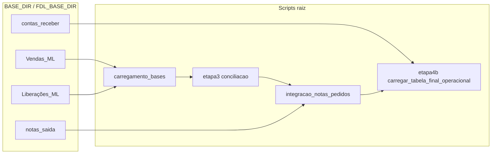
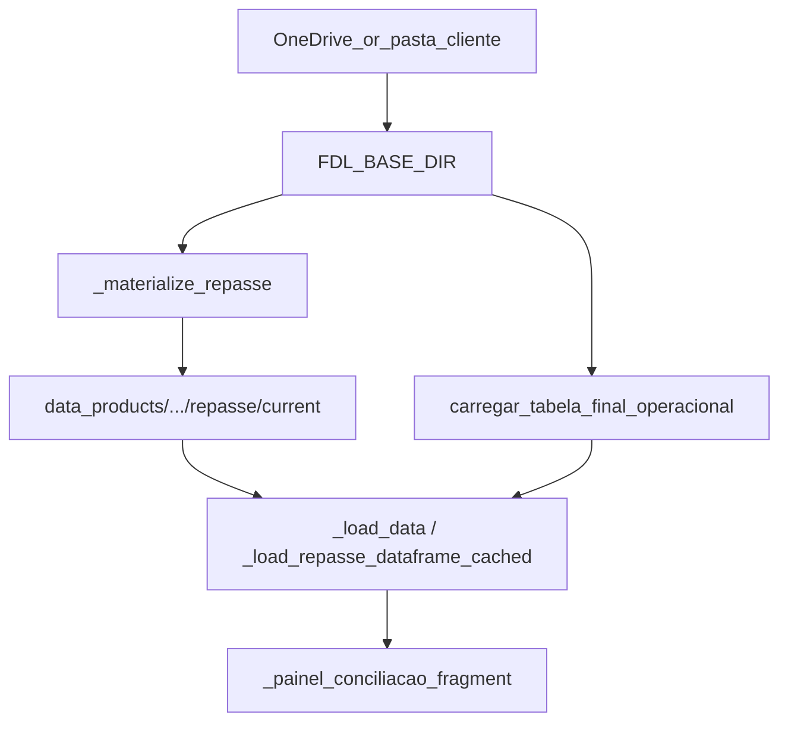

# Módulo Repasse — estrutura real no projeto

Mapeamento factual do fluxo de Repasse no repositório: pipelines em `BASE_DIR`, materialização em [`processing/materialize_financeiro.py`](../processing/materialize_financeiro.py), consumo no Streamlit via `_load_data` / `_load_repasse_dataframe_cached` em [`app_operacional.py`](../app_operacional.py), e variáveis `FDL_REPASSE_*`, `FDL_DATA_SOURCE`, precomputed.

## 1. Arquivos de processamento (backend)

**Função “final” do repasse (tabela operacional)**

- [`etapa4b_integracao_contas_receber.py`](../etapa4b_integracao_contas_receber.py) — função **`carregar_tabela_final_operacional(base_dir)`** (default `BASE_DIR` importado do módulo; em runtime usa **`FDL_BASE_DIR`** via `integracao_notas_pedidos` / cadeia de imports).
- Lógica principal: parte de **`build_conciliacao_com_notas`** (integração vendas/notas), lê **`contas_receber`**, classifica **`Ação sugerida`** (`_classificar_acao`), devolve o DataFrame final + `info`.

**Cadeia de dependências (resumo)**

- [`carregamento_bases.py`](../carregamento_bases.py) — **`carregar_bases_consolidadas`**, etapas de vendas/liberações (`etapa1_vendas`, `etapa2_liberacoes`).
- [`etapa3_conciliacao_vendas_liberacoes_validas.py`](../etapa3_conciliacao_vendas_liberacoes_validas.py) — conciliação vendas × liberações.
- [`integracao_notas_pedidos.py`](../integracao_notas_pedidos.py) — **`build_conciliacao_com_notas`**, notas de saída, etc.
- Pastas esperadas sob a base do cliente (também usadas na assinatura de materialização): `Vendas - Mercado Livre`, `Liberações_ML`, `notas_saida`, `contas_receber` — ver **`_collect_repasse_signature_files`** em [`processing/materialize_financeiro.py`](../processing/materialize_financeiro.py).

**Regras de negócio exemplares no repasse**

- Classificação de ação: **`_classificar_acao`** em [`etapa4b_integracao_contas_receber.py`](../etapa4b_integracao_contas_receber.py).
- Debug opcional do pipeline na materialização: **`FDL_DEBUG_REPASSE_PIPELINE=1`** → **`_emit_repasse_pipeline_debug`** no mesmo ficheiro de materialize.

## 2. Arquivo de materialização

**Ficheiro:** [`processing/materialize_financeiro.py`](../processing/materialize_financeiro.py)

- **Entrada do repasse:** **`_materialize_repasse`**.
- **Chama:** `from etapa4b_integracao_contas_receber import carregar_tabela_final_operacional` → **`df, info = carregar_tabela_final_operacional(base_dir)`**.
- **Assinatura de fontes:** **`build_repasse_source_signature(base_dir)`** (hash SHA256 dos ficheiros nas subpastas listadas em **`_collect_repasse_signature_files`**).
- **Identidade (metadados + colunas no Parquet):** **`_resolve_identity`** + **`_enrich_identity_columns`** → colunas `cliente_id`, `empresa_id`, `cnpj` no **`df_out`**.
- **Escrita:**
  - **`_write_parquet(df_out, out_dir / "dataset.parquet")`**
  - **`_write_repasse_app_mirror_csv(df, out_dir / "dataset_repasse_app.csv")`** — nota: CSV espelho usa o **`df` sem identidade** (comentário no código: schema precomputed; identidade só no Parquet).
  - **`_write_metadata(out_dir / "metadata.json", meta)`** — inclui `loader_info`, `app_mirror_csv`, opcionalmente `repasse_debug`.

**Loop `main`:** para `mod == "repasse"`, **`out_dir = root / path_cliente / path_empresa / mod / "current"`** — ver secção 3.

## 3. Estrutura de saída

**Caminho (padrão do CLI):**

- `--root` default em [`materialize_financeiro.py`](../processing/materialize_financeiro.py): **`REPO_ROOT / "data_products"`** (argumento `--root` pode alterar).

**Caminho completo (exemplo):**

`{root}/{path_cliente}/{path_empresa}/repasse/current/`

Exemplo típico:

`data_products/<cliente>/<empresa>/repasse/current/`

**Ficheiros gerados (nomes exatos):**

| Ficheiro | Função de escrita |
|----------|-------------------|
| **`dataset.parquet`** | **`_write_parquet`** — DataFrame com identidade (`df_out`) |
| **`dataset_repasse_app.csv`** | **`_write_repasse_app_mirror_csv`** — espelho sem `cliente_id`/`empresa_id`/`cnpj` |
| **`metadata.json`** | **`_write_metadata`** |

## 4. Arquivos do app (Streamlit)

**Ficheiro principal:** [`app_operacional.py`](../app_operacional.py)

**Leitura do dataset (repasse)**

- Função central: **`_load_data()`** — se **`_repasse_consume_mode() == "materialized"`**, lê **`FDL_REPASSE_MATERIALIZED_PATH`** / URL ou modo dynamic; senão chama **`_load_data_live()`**.
- **`_load_data_live()`** ramifica por **`_data_source_mode()`** (`precomputed`/`ready`/`table` → **`load_precomputed_conciliacao`**, `filesystem`/`onedrive` → **`load_data_from_onedrive`**, `upload_zip` → **`carregar_tabela_final_operacional_cache`**).
- Leitura de ficheiro precomputado/materializado: **`_load_precomputed_from_disk`** / **`_load_precomputed_from_remote`** (reutilizados pelo repasse materializado).

**Cache**

- **`@st.cache_data(..., ttl=900)`** — **`_load_repasse_dataframe_cached(load_signature)`** → delega em **`_load_data()`**.
- Chave lógica: **`_repasse_load_cache_signature(org_id)`** — inclui `org_id`, **`OPERACIONAL_CACHE_REVISION`** (alinhado a **`PIPELINE_DATA_REVISION`** em [`carregamento_bases.py`](../carregamento_bases.py)), modo repasse, paths/URL, **`_data_source_mode()`**, strict materialized.
- Cache separado do pipeline “live” local: **`carregar_tabela_final_operacional_cache`** (decorator **`@st.cache_data`** próprio) para **`upload_zip`** / fluxos que chamam diretamente a etapa 4b.

**Tratamento de erro (trecho repasse)**

- **`_strict_materialized()`** — falha dura se materializado obrigatório e path inválido.
- Se materializado falha e não strict: fallback para **`_load_data_live()`** com **`info["repasse_consume"] = "live_fallback"`** e campos de erro (`repasse_materialized_error`, etc.).
- No bloco principal da página (vista repasse), **`try/except`** em torno de **`_load_repasse_dataframe_cached`** com mensagens e opcionalmente **`st.stop()`** conforme flags.

**UI repasse**

- **`_painel_conciliacao_fragment(base, ts_proc)`** — filtros + tabela (não é `@st.fragment` por motivo documentado no docstring).

## 5. Variáveis de ambiente (repasse e dados)

**Consumo repasse (materializado vs live)**

- **`FDL_REPASSE_CONSUME_MODE`** — lido em **`_repasse_consume_mode()`**: valores típicos `live` / `materialized` (env + `st.secrets`).
- **`FDL_REPASSE_MATERIALIZED_PATH`** — caminho para `.csv` / `.xlsx` / `.xls` (**`_repasse_materialized_path_str()`**).
- **`FDL_REPASSE_MATERIALIZED_URL`** — download remoto (**`_repasse_materialized_url_str()`**).

**Modo dynamic (path derivado por org)**

- **`FDL_MATERIALIZED_PATH_MODE=dynamic`** — **`_dynamic_materialized_repasse_rel_path(org_id)`** monta  
  `{FDL_DATA_PRODUCTS_ROOT ou data_products}/{FDL_MATERIALIZED_CLIENTE_SLUG}/{org_id}/repasse/current/dataset_repasse_app.csv`.
- **`FDL_MATERIALIZED_CLIENTE_SLUG`**, **`FDL_DATA_PRODUCTS_ROOT`**.

**Strict / fallback**

- Variáveis relacionadas a **`_strict_materialized()`** (mensagem **`_STRICT_MATERIALIZED_USER_MSG`** no app) — impedem fallback para live quando configurado.

**Origem dos dados no modo “live” (não materializado)**

- **`FDL_DATA_SOURCE`** — **`_data_source_mode()`**: `precomputed`, `ready`, `table`, `filesystem`, `onedrive`, `upload_zip`, `api` (não implementado).
- Precomputado: **`FDL_PRECOMPUTED_PATH`**, **`FDL_PRECOMPUTED_URL`**.
- OneDrive: **`FDL_ONEDRIVE_URL`**, pastas sincronizadas, etc. (ver **`load_data_from_onedrive`**).

**Base local (pipeline etapa 4b)**

- **`FDL_BASE_DIR`** — usado pelo runner de materialização (`_set_base_dir`) e pela cadeia que usa **`BASE_DIR`**.

**Materialização (CLI)**

- **`FDL_BASE_DIR`** para repasse/frete; **`--root`** (default `data_products` relativo ao repo); **`--cliente`**, **`--empresa`**, **`--modulo`** incluindo `repasse`.

## 6. Fluxo completo (OneDrive → app)

1. **Dados na nuvem / pasta:** utilizador mantém (ou sincroniza) a estrutura sob **`FDL_BASE_DIR`** (ex.: OneDrive → pasta local espelhada).
2. **Processamento (live no servidor ou agendado):**
   - Em app com `FDL_DATA_SOURCE=onedrive` / `filesystem`: download ou sync → **`carregar_tabela_final_operacional_cache`** ou fluxo precomputado.
   - Ou agendamento: **`python processing/materialize_financeiro.py --base-dir ... --cliente X --empresa Y --modulo repasse`** → **`_materialize_repasse`** grava **`data_products/X/Y/repasse/current/{dataset.parquet, dataset_repasse_app.csv, metadata.json}`**.
3. **Leitura no app:**
   - **`FDL_REPASSE_CONSUME_MODE=materialized`** + path/URL (ou dynamic) → **`_load_data()`** lê o ficheiro via **`_load_precomputed_from_disk`** / remoto → **`_load_repasse_dataframe_cached`**.
   - Caso contrário → **`_load_data_live()`** conforme **`FDL_DATA_SOURCE`**.
4. **UI:** filtro por **`empresa`**, **`_painel_conciliacao_fragment`**.

## 7. Padrões a reaproveitar no faturamento

- **Estrutura de pastas `data_products`:** `<cliente>/<empresa>/<modulo>/current/` com **`dataset.parquet`**, CSV espelho (`dataset_*_app.csv`), **`metadata.json`** — já espelhado em [`processing/materialize_financeiro.py`](../processing/materialize_financeiro.py) para faturamento.
- **Env + secrets:** mesmo padrão `os.environ` com fallback **`st.secrets`** (ex.: repasse: **`_repasse_*`**; faturamento: **`FDL_FATURAMENTO_*`**).
- **Cache Streamlit:** assinatura por org + revisão + paths — análogo a **`_repasse_load_cache_signature`** / **`_load_repasse_dataframe_cached`**.
- **Leitura materializada:** path relativo ao repo (**`_REPO_APP_ROOT`**) ou absoluto; URL com **`_download_file_bytes`** / tentativas HTTP.
- **Coluna `empresa`:** **`DATASET_EMPRESA`** ou dynamic (**`_dataset_empresa_label()`**, **`_filtrar_df_col_empresa_por_contexto`**).
- **Erro:** mensagens em `info` dict, fallback controlado, **`_strict_materialized()`** — mesmo espírito aplicado ao faturamento.
- **Não duplicar regras de negócio no materialize:** comentário explícito no topo de **`materialize_financeiro.py`** — materialização chama as mesmas funções do pipeline.

---

**Ver também:** [Operação: materialização financeira](operacao_materializacao.md) (lock, escrita atómica, agendamento).
